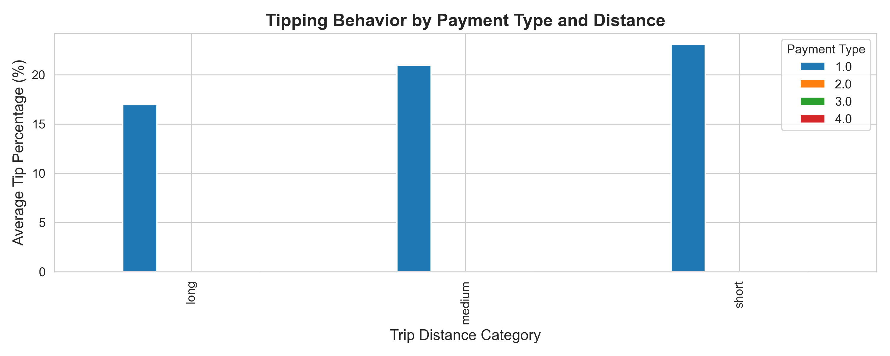
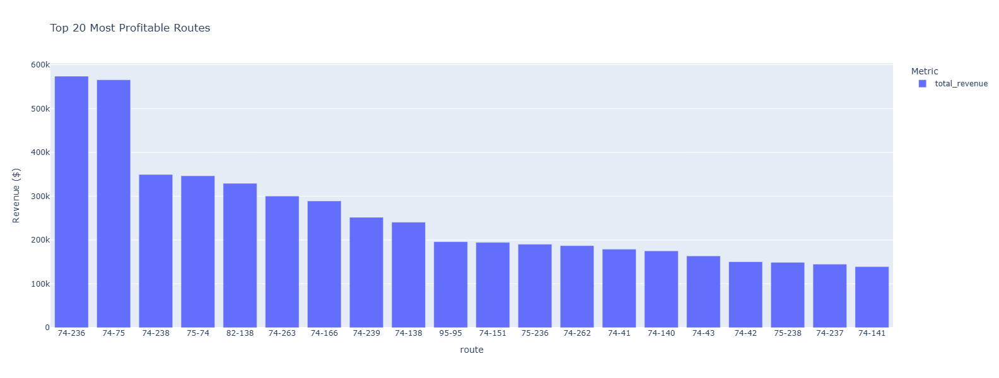

# Big Data Analytics on NYC Taxi Transportation Data
### Part 2: MapReduce & Visualisation Analysis
- **Student Name:** Mmathapelo Thotse
- **Student Number:** u22888676
- **Course:** MIT805 - Big Data Analytics
- **Date:** 10 October 2025

---

## 1. Introduction

Traditional data processing techniques are no longer adequate due to the exponential growth in data in the transportation sector.  The second stage of a Big Data project that uses **Hadoop MapReduce** and **data visualisation** tools to analyse the **New York City Yellow Taxi Trip dataset** is presented in this project.  The objective is to derive practical insights that can guide business choices about transportation planning and urban mobility.

### 1.1 Background and Context

NYC’s taxi system generates millions of trip records daily. Analysing this data requires Big Data technologies like MapReduce, which splits tasks into:
- **Map phase**: filtering and transformation
- **Reduce phase**: aggregation and summarization

### 1.2 Project Objectives

- Implement MapReduce algorithms
- Process large-scale taxi data
- Create meaningful visualisations
- Apply Big Data concepts
- Extract business value


## 2. Hadoop Overview and Setup

### 2.1 What is Hadoop?

**Apache Hadoop** is an open-source framework designed for the distributed storage and processing of large datasets across clusters of computers. It follows the **MapReduce programming model**, which splits tasks into two main phases:

- **Map Phase:** Processes and filters input data into key-value pairs.
- **Reduce Phase:** Aggregates and summarises the mapped data.

Hadoop is highly scalable and fault-tolerant, making it ideal for handling **Volume**, **Velocity**, and **Variety**—three of the core Vs of Big Data.

### 2.2 Local Hadoop Setup
To simulate a distributed environment locally, I set up a **single-node Hadoop cluster** on my machine using the following steps:

1. Installed Java (required for Hadoop runtime).
    - Download the Java installation file
    - Create a folder under the C drive and install Java directly into the Java folder created.
    - Cut and paste jdk folder in the Program Files into the Java folder created. Delete the Java folder under Program Files
    - configure Java environment - env. var. --> name: `JAVA_HOME`, value: `C:\Java\jdk1.8.0_*\bin` copied path from bin folder under Java
    - configure system variables, edit `path` and create new variable - paste: `C:\Java\jdk1.8.0_*\bin` done
    - check by running `java` on CLI

3. Downloaded and configured.
    - download `hadoop-3.4.2.tar`, unzip, copy it to the C drive and rename it to `Hadoop`
    - in etc folder, edit `hadoop-env` to paste `C:\Java\jdk1.8.0_*\bin`, resulting in `set JAVA_HOME=C:\Java\jdk1.8.0_*\bin`
    - configure Java environment - env. var. --> name: `HADOOP_HOME`, value: `C:\hadoop\bin` copied path from bin folder under Java
    - configure system variables, edit `path` and create new variable - paste: `C:\hadoop\bin` and `C:\hadoop\sbin` done
   - check by running `hadoop` on CLI

3. Set configurations for Hadoop to run on our system
    - got to `hadoop -> etc -> hadoop` folder to edit `core-site.xml` file
    - add property with name and value
   ```xml
    <configuration>
    <property>
      <name>fs.defaultFS</name>
      <value>hdfs://localhost:8020</value>
    </property>
    </configuration>
   ```
   - got to `hadoop -> etc -> hadoop` folder to edit `httpfs-site.xml` file
    - add property with name and value
   ```xml
    <configuration>
    <property>
      <name>dfs.replication</name>
      <value>1</value>
    </property>
   <property>
      <name>dfs.namenode.name.dir</name>
      <value>C:\hadoop\data\namenode</value>
    </property>
   <property>
      <name>dfs.datanode.name.dir<</name>
      <value>C:\hadoop\data\datanode</value>
    </property>
    </configuration>
   ```
   - create `data` folder and `namenode` & `datanode` inside it
   - go to `etc` -> `hadoop` to edit `mapred-site.xml`
   ```xml
    <configuration>
    <property>
    <name>mapreduce.framework.name</name>
    <value>yarn</value>
    </property>
    <property>
    <name>mapreduce.map.java.opts</name>
    <value>-Xmx4096m</value>
    </property>
    <property>
    <name>mapreduce.reduce.java.opts</name>
    <value>Xmx6144m</value>
    </property>
    </configuration>
   ```
   - go to `etc` -> `hadoop` to edit `yarn-site.xml`
   ```xml
    <configuration>
    <property>
      <name>yarn.nodemanager.aux-services</name>
      <value>mapreduce_shuffle</value>
    </property>
   <property>
      <name>yarn.nodemanager.auxservices.shuffle.class</name>
      <value>org.apache.hadoop.mapred.ShuffleHandler</value>
    </property>
    </configuration>
4. Fixed `bin` folder to run on Windows
- Delete the `bin` folder inside the `hadoop` folder
- Download the new bin folder `https://drive.google.com/file/d/1nCN_jK7EJF2DmPUUxgOggnvJ6k6tksYz/view` and paste it inside the `hadoop` folder
- Run `winutils.exe` file - it will suggest to download `MSVCR120.dll` file and paste the file inside `C://Windows/System32/` folder
5. Download and install the `C++ redistributable` for Visual Studio

6. Format `namenode`
```bash
hdfs namenode -format
```
Look for `name node successfully formatted`

7. Launch `Hadoop` cluster
- in root directory, run `cd sbin`, i.e. `C:hadoop\sbin`
- start `Hadoop` cluster: `namenode` and `datanode`
```bash
start-dfs.cmd
```
- start `resource manager`
```bash
start-yarn.cmd
```
- check on `localhost:9870`
- check cluster size and number of nodes: `localhost:80888`
- stop all nodes
```bash
stop-all.cmd
```
5. Created HDFS directories and uploaded the dataset
```bash
hdfs dfs -mkdir -p /nyc_tlc_data
hdfs dfs -put green_taxi_combined.csv /nyc_tlc_data/data/output
```
This setup enabled me to run Python-based MapReduce jobs using Hadoop Streaming.

---
## 3. Visualisations and Their Value

After processing the dataset using MapReduce, I created two key visualisations to effectively communicate the insights.

## 3.1 Tipping Behaviour
**Visualisation:** Grouped bar chart showing average tip percentage by payment type and trip distance category (short, medium, long).


**Insight:**
Credit card payments yield higher tips than cash.

**Business Value:**
  Encourages cashless payments to boost driver earnings.

## 3.2 Route Profitability
**Visualisation:** Interactive dashboard (Plotly) showing:


**Insight:**
- Routes to/from airports (location id 74) and business districts are most profitable.
- Some short-distance routes yield high revenue per mile.

**Business Value:**
- Enables strategic driver positioning.
- Supports route-based pricing models and fleet optimisation.

## 4. Conclusion
This phase of the project demonstrated the power of Hadoop MapReduce in processing large-scale transportation data. The visualisations provided clear, actionable insights that can help:

- Improve operational efficiency
- Enhance customer satisfaction
- Maximise revenue through data-driven strategies

The combination of distributed processing and effective visualisation bridges the gap between raw data and business intelligence.

---

## References

1. [NYC Open Data – TLC Trip Records](https://opendata.cityofnewyork.us/)
2. Dean & Ghemawat (2004) – MapReduce
3. White (2015) – *Hadoop: The Definitive Guide*
4. [Apache Hadoop Documentation](https://hadoop.apache.org/)
5. McKinney (2017) – *Python for Data Analysis*

---

## Appendix

### A. GitHub Repository
`https://github.com/mmathapelothotse/bigdata-transport-analysis.git`

### B. Video Demonstration
[your-video-platform]

---